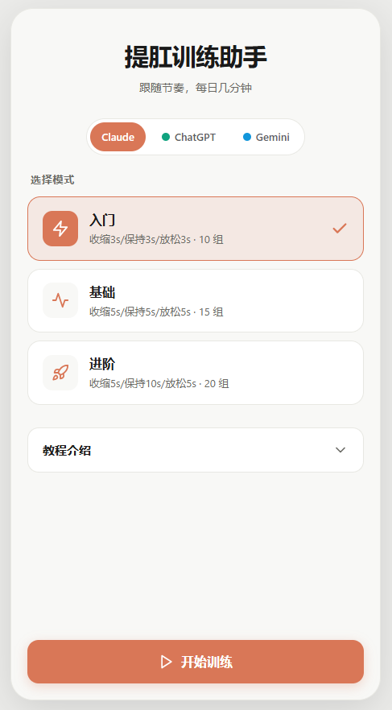
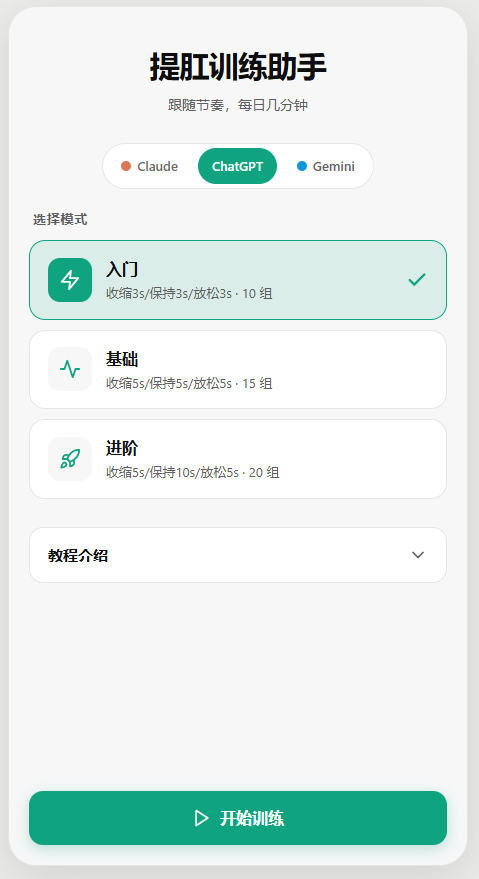
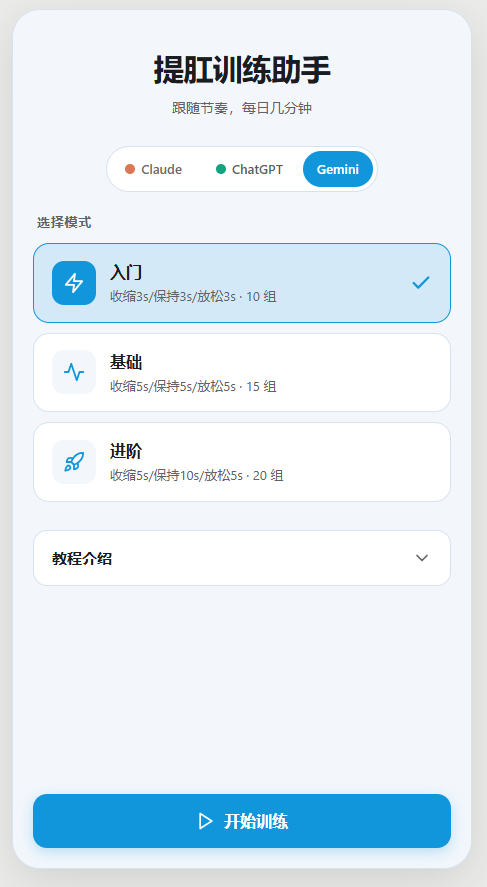
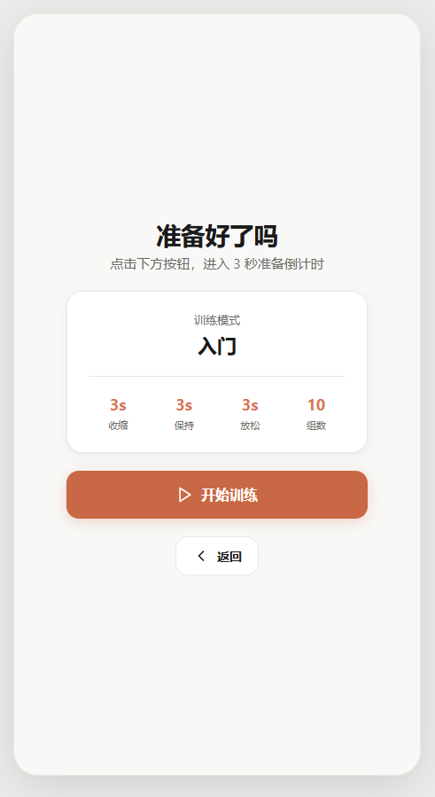
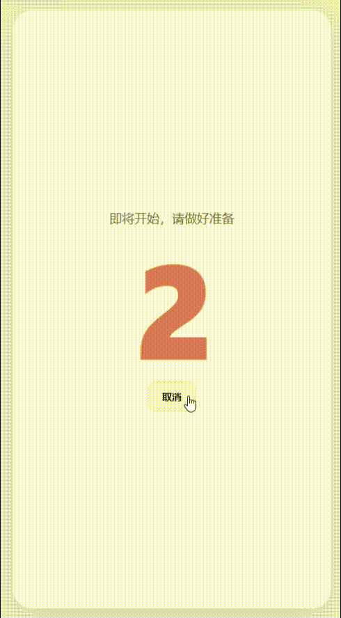

# 提肛训练助手

一个纯前端、单文件的盆底肌（Kegel）训练助手，通过节奏化的收缩-保持-放松循环引导用户完成每日训练。支持三种训练强度、三种 AI 主题皮肤，移动端优先设计。

## 页面展示

### 首页

进入首页后，顶部显示标题和副标题，下方是三套 AI 主题皮肤（Claude / ChatGPT / Gemini）的切换器，点击即可实时切换。中部为训练模式选择区，提供入门、基础、进阶三档，每档显示对应的收缩/保持/放松时长和组数。底部提供可折叠的教程介绍和「开始训练」按钮。

<p align="center">
  
</p>

### 主题切换

支持三套主题皮肤，配色分别致敬 Claude（奶油底色 + 橙色点缀）、ChatGPT（灰白底色 + 绿色点缀）、Gemini（浅蓝底色 + 蓝色点缀）。切换即时生效，偏好自动保存到 `localStorage`，下次打开无需重新选择。

<p align="center">
  
  &nbsp;&nbsp;
  
</p>

### 准备页

选择模式和主题后进入准备页，页面上方展示当前训练模式的详细参数（收缩/保持/放松时长、组数），点击「开始训练」进入 3 秒倒计时，为训练做好准备。

<p align="center">
  
</p>

### 训练页

训练页是核心交互界面。顶部显示当前组数和总进度条，中部是动态变化的引导图标——图标会在「收缩」阶段缩小、在「保持」阶段停留在最小处并伴随轻微脉动、在「放松」阶段放大回原形。不同主题有不同的动画表现：Claude 主题支持形态变化（图标形状从 AI logo 渐变为星芒光点），ChatGPT 主题在缩放基础上叠加旋转效果。

底部提供暂停/继续和结束训练按钮。暂停时显示模糊遮罩，保护隐私的同时方便随时中断。训练完成后自动跳转至完成页，展示本次用时和完成组数。

<p align="center">
  
</p>

## 训练模式

| 模式 | 收缩 | 保持 | 放松 | 组数 | 预计时长 |
| ---- | :--: | :--: | :--: | :--: | :------: |
| 入门 | 3s | 3s | 3s | 10 组 | ~1.5 分钟 |
| 基础 | 5s | 5s | 5s | 15 组 | ~3.75 分钟 |
| 进阶 | 5s | 10s | 5s | 20 组 | ~6.7 分钟 |

## 页面流程

```
首页 → 准备页 → 3 秒倒计时 → 训练页（收缩 → 保持 → 放松，循环） → 完成页
（选模式/主题）                 ↓ 暂停 / 结束
                         暂停遮罩 / 确认弹窗
```

## 技术栈

纯静态 HTML/CSS/JS，零依赖构建工具，开箱即用。

- **动画**：CSS `@keyframes` + `requestAnimationFrame` 驱动的 SVG 变形与缩放
- **形态变化**：[flubber](https://github.com/veltman/flubber)（CDN 引入，缺失时自动回退为纯缩放）
- **主题图标**：内联 SVG，OpenAI / Google 官方素材
- **存储**：`localStorage` 持久化主题偏好
- **触觉反馈**：阶段切换时触发 `navigator.vibrate()`
- **响应式**：移动端全屏，桌面端居中手机外壳展示
- **无障碍**：`prefers-reduced-motion` 适配、ARIA 属性、键盘导航

## 快速开始

直接用浏览器打开 `index.html` 即可，无需安装任何依赖。

```bash
# 或者用任意静态服务器
npx serve .
# 访问 http://localhost:3000
```

## 文件结构

```
KegelPage/
├── index.html              # 主文件（HTML + CSS + JS 全部内联）
├── claude-icon-morph.html  # Claude 图标形态变化实验文件
├── public/                 # 截图与素材
│   ├── 首页.png            # 首页截图
│   ├── 首页2.png           # ChatGPT 主题截图
│   ├── 首页3.png           # Gemini 主题截图
│   ├── 准备界面.png        # 准备页截图
│   ├── 训练页面.gif        # 训练动画演示
│   ├── Gemini.svg          # Gemini 图标
│   └── openai.svg          # ChatGPT 图标
└── README.md
```

## 训练建议

1. **收缩** — 跟随图标缩小，缓慢收紧盆底肌（像憋尿一样）
2. **保持** — 图标停在最小处，持续发力不松懈
3. **放松** — 跟随图标放大，缓慢放松肌肉
4. 全程用鼻子呼吸，腹部放松；建议每天 1 次，循序渐进，切勿憋气或过度用力

## License

MIT
